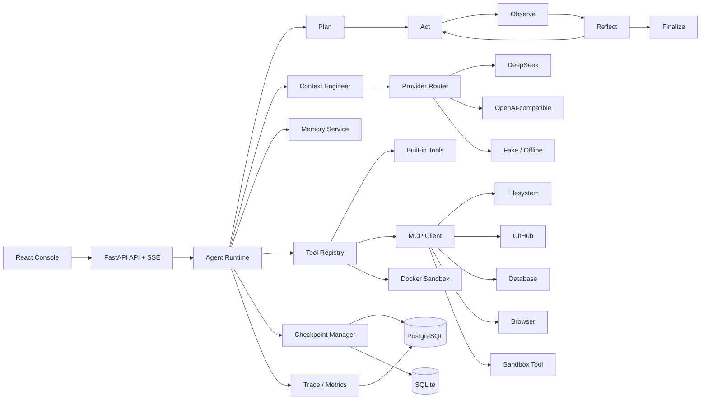
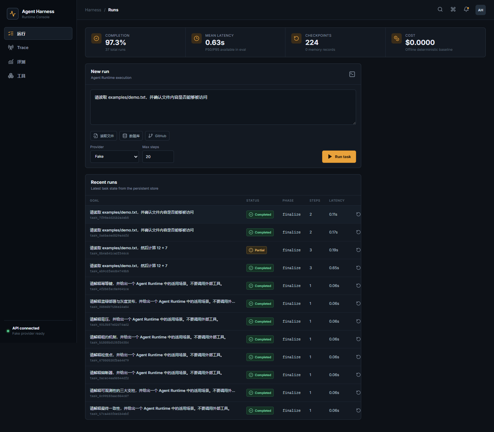
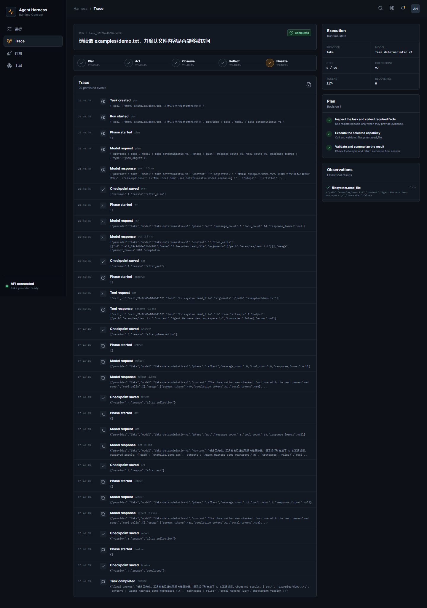

# Agent Harness

[](https://github.com/2328312928-commits/agent-harness/actions/workflows/ci.yml)
[](https://github.com/2328312928-commits/agent-harness/releases)
[](LICENSE)

一个可检查点恢复、可观测、可评测的开源 Agent Runtime。它不是只包一层聊天界面，
而是把 Agent 执行所需的状态、工具协议、沙箱、上下文、评测和故障恢复拆成可替换组件。

## Online Demo

- 控制台：<https://agent-harness-console.onrender.com>
- API 文档：<https://agent-harness-api-ojtj.onrender.com/docs>
- 健康检查：<https://agent-harness-api-ojtj.onrender.com/api/health>

Render 免费实例在空闲后会休眠，首次访问可能需要几十秒唤醒。在线环境使用
`FakeProvider`；云端未挂载 Docker Socket，因此代码执行工具会安全失败并由 Runtime
进入恢复流程。完整 Docker Sandbox 请使用本地 Compose 部署。

## 核心能力

- **Agent Loop**：完整执行 `Plan -> Act -> Observe -> Reflect -> Finalize`，工具失败后自动反思并重新规划。
- **Tool Registry**：统一注册、JSON Schema 参数校验、权限、超时、幂等重试与取消。
- **MCP**：实现 stdio 与 Streamable HTTP MCP Client；内置 stdio Server 暴露文件、GitHub、数据库、浏览器和受限 Python 执行工具。
- **Memory**：短期对话、任务状态、长期记忆、相关性召回和 Token 预算。
- **Context Engineering**：滚动摘要、上下文裁剪、长期记忆检索和按 Phase 选择 Provider。
- **Checkpoint / Recovery**：每个执行阶段持久化状态；任务中断或服务重启后可恢复。
- **Docker Sandbox**：默认无网络、只读根文件系统、资源限制、非 root 用户和超时终止。
- **Observability**：持久化每一步输入输出、工具调用、Token、延迟、失败原因和完整 Trace。
- **Evaluation**：110 条任务，覆盖推理、文件、代码、数据库、记忆、恢复、上下文压缩、浏览器、GitHub 与混合工作流。
- **Provider 抽象**：支持 DeepSeek、任意 OpenAI-compatible 接口和离线确定性 Fake Provider。

## 架构



详细设计见 [architecture.md](docs/architecture.md)、[design.md](docs/design.md) 和
[failure-cases.md](docs/failure-cases.md)。

## Docker Compose 一键运行

```bash
cp .env.example .env
docker compose up --build
```

打开：

- 控制台：<http://localhost:8080>
- API 文档：<http://localhost:8000/docs>
- 健康检查：<http://localhost:8000/api/health>





默认使用 `FakeProvider`，不需要 API Key。接入 DeepSeek 时在 `.env` 中设置：

```dotenv
DEFAULT_PROVIDER=deepseek
DEEPSEEK_API_KEY=your-key
DEEPSEEK_MODEL=deepseek-chat
```

`render.yaml` 提供了 PostgreSQL、API 和静态控制台的在线 Demo Blueprint，部署说明见
[deployment.md](docs/deployment.md)。

## 本地开发

```bash
python -m venv .venv
.venv/Scripts/pip install -e ".[dev]"   # Windows
# source .venv/bin/activate && pip install -e ".[dev]"  # Linux/macOS

agent-harness serve --reload
cd web && npm install && npm run dev
```

运行离线 Demo：

```bash
agent-harness task "请读取 examples/demo.txt，然后计算 12 + 7"
```

## Benchmark

```bash
python scripts/build_eval_dataset.py
python scripts/run_benchmark.py
```

结果会写入 `evals/results/*.json` 和 `docs/benchmark-report.md`。离线报告用于验证
Runtime、工具契约、恢复链路与评测管线，不冒充真实模型的泛化能力。配置 DeepSeek
或 OpenAI-compatible Provider 后，可用同一数据集生成模型对比报告。

当前 110 条离线回归的真实结果为：任务成功率 100%、工具准确率 100%、P50 484ms、
P95 2.18s、恢复成功率 100%。该结果用于证明 Runtime 本身可工作，不表示模型能力。
真实 DeepSeek 评测流程见 [model-benchmark.md](docs/model-benchmark.md)。

DeepSeek `deepseek-chat` 的 100 条真实模型任务结果为：任务成功率 100%、工具准确率
100%、P50 7.32s、P95 15.43s、总成本约 `$0.4563`、恢复成功率 100%。完整报告见
[deepseek-chat-main.md](docs/benchmarks/deepseek-chat-main.md)。Browser 网络类别作为
独立集成测试保留，不计入这 100 条稳定基线。

## API 示例

创建并执行任务：

```bash
curl -X POST http://localhost:8000/api/tasks \
  -H "Content-Type: application/json" \
  -d '{"goal":"请列出目录下的文件，再计算 19 - 8","provider":"fake"}'
```

查看 Trace、取消和恢复：

```bash
curl http://localhost:8000/api/tasks/TASK_ID/events
curl -X POST http://localhost:8000/api/tasks/TASK_ID/cancel
curl -X POST http://localhost:8000/api/tasks/TASK_ID/resume
```

## 项目结构

```text
agent_harness/
  api/              FastAPI、SSE、容器装配
  context/          上下文裁剪、摘要和记忆注入
  domain/           状态机、领域模型和错误契约
  evals/            数据集、Grader 和 Benchmark Runner
  mcp/              MCP Client、stdio/HTTP Transport、Demo Server
  memory/           长期记忆与 Token 估算
  observability/    Trace、Event Bus、成本和分位数
  providers/        DeepSeek、OpenAI-compatible、Fake
  runtime/           Plan-Act-Observe-Reflect 执行器
  sandbox/          Docker 与开发用本地沙箱
  storage/          SQLAlchemy 持久化与检查点
  tools/            工具注册表、权限、校验、重试和内建工具
web/                React + TypeScript 控制台
evals/dataset/      110 条 JSONL 任务
docs/               架构、设计、故障案例和 Benchmark
```

## 安全边界

- Docker Sandbox 默认禁用网络、移除 Linux capabilities、启用 `no-new-privileges` 并限制 CPU、内存、PID 和运行时间。
- `DatabaseQueryTool` 只允许单条只读 SQL。
- 文件工具限制在 `WORKSPACE_ROOT` 内，拒绝路径穿越。
- Browser 工具拒绝 localhost、私网、链路本地和保留地址。
- MCP 工具同样经过 Tool Registry 的 Schema 校验和权限检查。
- `LocalProcessSandbox` 只用于测试或显式开发模式，不是安全边界。

## License

MIT
