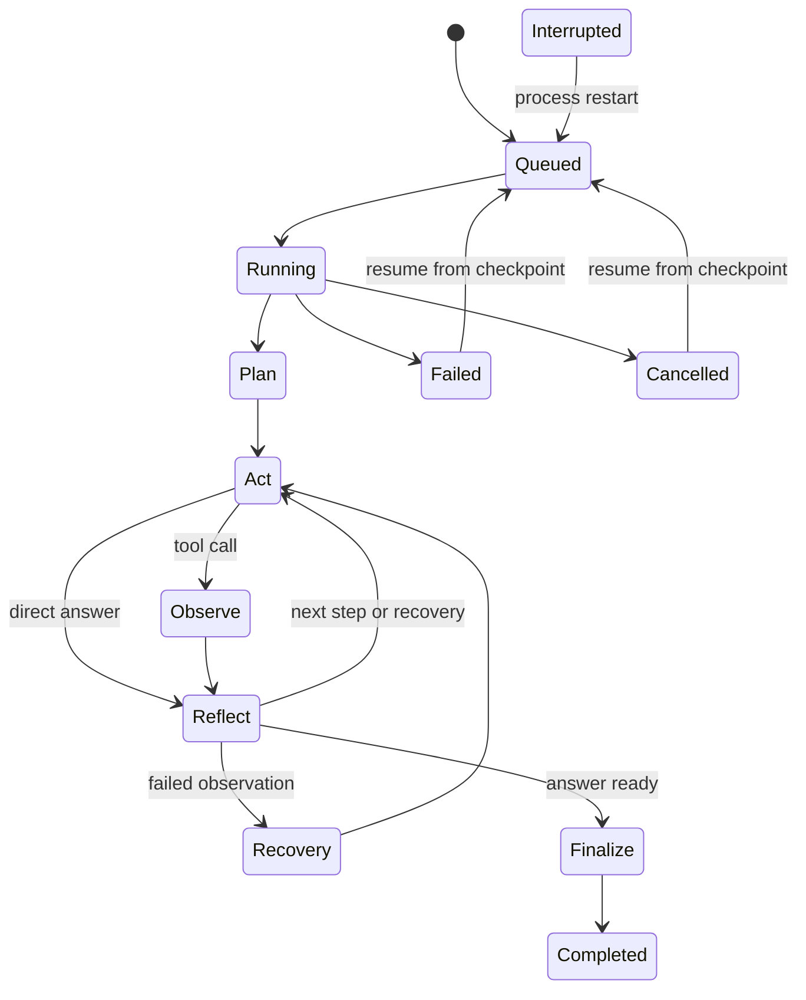
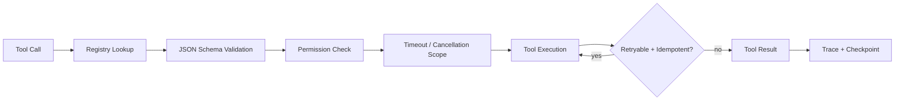

# Architecture

## Runtime Model

Agent Harness treats one task as a persistent state machine. The state is serialized after
every meaningful transition, so process memory is an optimization rather than the source
of truth.



The execution loop is intentionally explicit:

1. **Plan** creates a revisioned `AgentPlan` with expected tools and assumptions.
2. **Act** calls the selected Provider with the current context and registered tool schemas.
3. **Observe** executes every requested tool through the Tool Registry and writes the result.
4. **Reflect** evaluates the observation and decides whether to continue or recover.
5. **Recovery** rebuilds the plan after a failed observation, with a bounded retry count.
6. **Finalize** persists the answer, token usage, and final checkpoint.

## Component Boundaries

| Component | Responsibility | Replaced by |
| --- | --- | --- |
| Provider Router | Phase-aware model and provider selection | DeepSeek, OpenAI-compatible, local models |
| Context Engineer | Retrieve, summarize, trim, and budget context | Policy-specific context strategies |
| Memory Service | Short-term messages and long-term recall | Vector DB or remote memory service |
| Tool Registry | Validate, authorize, execute, retry, cancel | Internal tool platform |
| MCP Client | Discover and call external MCP tools | External MCP marketplace/server |
| Sandbox | Execute untrusted code with resource limits | Firecracker, gVisor, Kubernetes jobs |
| Checkpoint Store | Persist state and event history | PostgreSQL, object storage, event log |
| Eval Runner | Reproduce tasks and grade outcomes | CI benchmark or model regression gate |

## Recovery Contract

A `CheckpointRecord` contains the full serialized `AgentState`:

```json
{
  "task_id": "task_...",
  "status": "running",
  "phase": "reflect",
  "goal": "...",
  "messages": [],
  "plan": {"revision": 2, "steps": []},
  "observations": [],
  "reflections": [],
  "token_budget": {"limit": 32000, "prompt_tokens": 0, "completion_tokens": 0},
  "metadata": {"recovery_count": 1},
  "checkpoint_version": 12
}
```

The latest checkpoint is authoritative on resume. Tool calls that completed before the
checkpoint are not replayed because their observations are already part of state. This
requires tools to be idempotent when automatic retry is enabled.

## Tool Security Pipeline



Permissions are deny-by-default at the task boundary. The API Demo grants the complete
set for local experiments, while an eval task can explicitly restrict its permissions
to test recovery and security behavior.

## MCP Boundary

The MCP Client implements:

- `initialize`
- `notifications/initialized`
- `tools/list`
- `tools/call`
- stdio and HTTP transports
- MCP error normalization and Tool Registry wrapping

The bundled stdio server exposes five tools so the integration can be exercised without
an external MCP vendor:

- `fs_read`
- `github_search_repositories`
- `database_query`
- `browser_fetch`
- `sandbox_run_python`

## Observability Data Flow

Every state transition emits a `TraceEvent`. Events are written to the database first,
then published to in-process subscribers. The browser consumes the same persisted
history through an SSE endpoint, so refreshing or reconnecting does not lose events.

Recorded dimensions include:

- Phase and step
- Model/provider input summary and output
- Tool arguments, result, attempts, and error type
- Duration, token usage, and checkpoint version
- Recovery count and failure reason

## Scaling Path

The current implementation is a single-process runtime with persistent state. To scale:

1. Move task scheduling and cancellation to a durable queue.
2. Store checkpoints in PostgreSQL and publish events to Redis Streams or Kafka.
3. Execute each task as a Kubernetes Job.
4. Move code execution to isolated gVisor or Firecracker workers.
5. Replace event fan-out with a dedicated trace backend.

